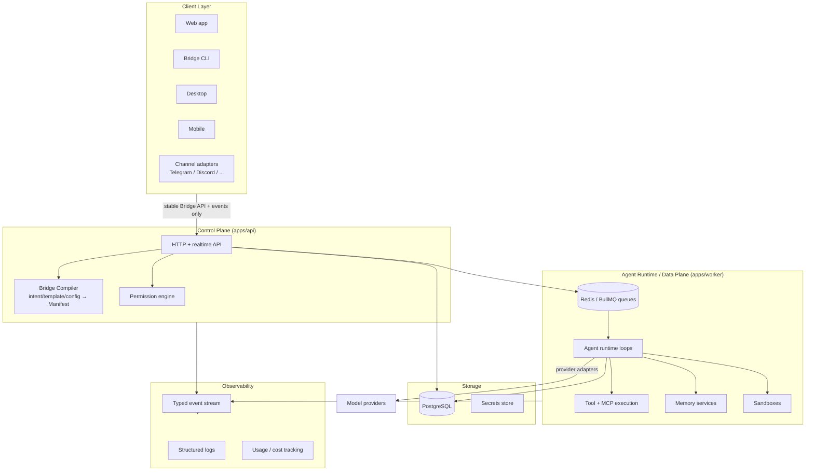
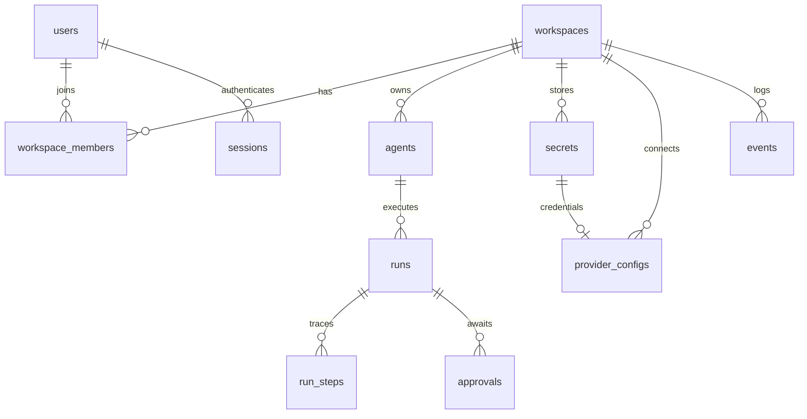

# Bridge Agent OS — Architecture

Status: Phases 0–4 complete (foundation, accounts, runtime, tools and
approvals). Decisions recorded in `docs/architecture/ADR-*.md`.

## 1. System Overview



Boundaries (explicit in the repository):

| Boundary | Lives in | Responsibility |
|---|---|---|
| Control plane | `apps/api` | users, workspaces, agents, manifests, templates, integrations, secret references, deployments, permissions, dashboards, configuration |
| Runtime / data plane | `@bridge/runtime`, hosted by `apps/worker` or by `apps/api` in embedded mode | model execution, agent loops, runs, tools, MCP, memory, schedules, channels, sandboxes |
| Bridge Compiler | `@bridge/runtime` (`compile`) + `@bridge/spec` | intent/template/config → validated Manifest → runtime plan |
| Client layer | `apps/web`, later CLI/desktop/mobile/channels | thin clients of the API; zero domain logic |
| Observability | typed events (`@bridge/spec/events`) + `events` table + structured logs | runs, traces, tasks, tool calls, tokens, costs, failures, approvals |
| Contracts | `@bridge/spec`, `@bridge/sdk` | the only vocabulary shared across planes |

The API and worker share packages and one Postgres — a modular monolith. On a
server they are separate processes (with Redis for scheduled jobs); on the
desktop the API hosts the runtime in-process, because the embedded database is
single-process (ADR-0009, ADR-0012). No microservices, no Kubernetes in the
MVP (ADR-0001). Nothing prevents splitting later because the planes only
communicate through the database and typed events.

## 2. Repository Layout

```text
apps/
  api/          Control plane: Hono HTTP API (ADR-0005)
  worker/       Runtime host for server deployments; scheduled jobs (ADR-0012)
  web/          Web client: Vite + React SPA, thin (ADR-0006)
  cli/          `bridge` command line — a client of the same public API
packages/
  spec/         @bridge/spec   — Manifest, dashboard schema, permissions, events, templates (ADR-0002)
  sdk/          @bridge/sdk    — provider / tool / channel adapter interfaces (ADR-0007)
  core/         @bridge/core   — ids, errors, env, logging, crypto (ADR-0011)
  db/           @bridge/db     — Drizzle schema, migrations, server + embedded drivers (ADR-0003, ADR-0009)
  queue/        @bridge/queue  — JobQueue interface, BullMQ + in-process drivers (ADR-0010)
  providers/    @bridge/providers — Anthropic + OpenAI-compatible adapters, pricing, registry
  runtime/      @bridge/runtime   — compiler, agent loop, executor, tools, MCP, sandbox (ADR-0012, ADR-0013)
  channels/     @bridge/channels  — Telegram + Discord adapters, inbound message → run (ADR-0007)
  ui/           @bridge/ui     — design tokens (CSS variables), brand assets, base styles
docs/
  architecture/ ADR-*.md
docker-compose.yml   Local Postgres + Redis
.github/workflows/   CI
```

Dependency rule (enforced by review, later by lint):

```text
apps/*  →  @bridge/{spec,sdk,core,db,queue,providers,runtime,ui}
@bridge/runtime → @bridge/{core,db,providers,sdk,spec}
@bridge/providers → @bridge/{sdk,spec}
@bridge/db → @bridge/{core,spec}
@bridge/sdk → @bridge/spec
@bridge/queue → (bullmq only; no Bridge deps)
@bridge/spec → zod only        (pure contracts, no runtime deps)
Nothing imports from apps/*.
```

## 3. Stack

| Concern | Choice | ADR |
|---|---|---|
| Language | TypeScript, strict everywhere | ADR-0001 |
| Monorepo | pnpm workspaces + Turborepo | ADR-0001 |
| Lint/format | Biome (single tool) | ADR-0001 |
| Contracts/validation | Zod schemas in `@bridge/spec` | ADR-0002 |
| Database | PostgreSQL + Drizzle; server driver (postgres.js) or embedded (PGlite) | ADR-0003, ADR-0009 |
| Queue/background | `JobQueue` interface; BullMQ/Redis or in-process | ADR-0004, ADR-0010 |
| API framework | Hono on Node | ADR-0005 |
| Web | Vite + React SPA, Tailwind v4 + token CSS | ADR-0006 |
| Adapters | `@bridge/sdk` interfaces (provider/tool/channel) | ADR-0007 |
| Deployment targets | `local` / `self-hosted` / `cloud`, one portable Manifest | ADR-0008 |
| Secrets & crypto | `SecretStore` interface; Node stdlib crypto, no native deps | ADR-0011 |
| Run dispatch | Claimed from the database with `SKIP LOCKED`, heartbeated | ADR-0012 |
| Approvals | Loop is a serializable frame stack; a paused run is a checkpoint | ADR-0013 |
| Tests | Vitest (against embedded Postgres) |  |
| Logging | pino, structured JSON |  |
| Dev/server infra | Docker Compose (postgres:17, redis:7) — optional |  |

## 3a. Deployment targets and runtime portability

Docker is a development and server-distribution choice, **never a runtime
prerequisite** (ADR-0008). Each infrastructure dependency sits behind a driver
with an implementation that requires nothing installed:

| Concern | `local` (desktop) | `self-hosted` / `cloud` |
|---|---|---|
| Database | PGlite embedded in-process (`pglite:<path>`) | Postgres server (`postgres://…`) |
| Queue | In-process `LocalQueue` | BullMQ on Redis |
| Secrets | OS keychain (planned) / encrypted rows | Encrypted rows / KMS |
| Lifecycle | Desktop app manages the runtime | Operator or Bridge Cloud |

The same schema, migrations, queries, API and runtime code serve all three.
A Manifest carries `deployment: { target, background }` and nothing else that
is target-specific, so an agent moves between targets by changing one field.
Runtime location and model location are independent: a `local` agent can call
hosted APIs, local models, or both.

## 4. The Bridge Manifest (`@bridge/spec`)

The canonical declarative description of an agent system. Zod is the single
source of truth; TS types are inferred. Key design points:

- `specVersion` integer literal per schema revision. `parseManifest()` runs
  `migrateManifest()` (versioned upgrade functions) before validation, so old
  stored manifests always load.
- Provider-independent `ModelRef { provider, model }`. Models are declared
  once (`models.default` + named `models.roles` like `reasoning`, `fallback`,
  `critic`) and referenced by role name from agents — routing changes touch
  one place.
- `agents[]` with an explicit `entryAgent`; each agent has instructions, an
  optional model role, tool grants (by name), and `canDelegateTo` for
  subagent spawning.
- `tools[]` declares grants (`native | mcp | http | custom` + config);
  `permissions` holds a default effect plus ordered first-match rules
  `{ resource, actions, effect: allow|deny|ask }`.
- `triggers` (cron schedules + event subscriptions), `channels`,
  `runtime.limits` (concurrency, run seconds, token budget, daily spend) and
  `runtime.sandbox` (network/filesystem levels) exist in v1 so that later
  phases extend rather than restructure.
- `dashboard` optionally embeds a Dashboard spec.

Templates = data: a partial Manifest + metadata, merged and validated through
the same pipeline as blank or AI-generated agents.

## 5. Dashboard Spec (`@bridge/spec/dashboard`)

`Dashboard → pages[] → sections[] → widgets[]` plus navigation and theme.
Widgets are a Zod discriminated union (`metric`, `chart`, `taskList`,
`agentStatus`, `activity`, `calendar`, `table`, `approvalQueue`, `chat`,
`logs`, `text`, `embed`), each with a typed `data` binding. Theme is design
tokens only (accent, background, appearance) — Bridge branding is not
overridable. The renderer is Phase 6; the schema is stable now so templates
and the AI editor target it from day one.

## 6. Permissions and approvals

Pure, deterministic evaluation, consulted on **every** tool call:

```text
decidePermission(policy, resource, action) → { effect, matched }
decideToolPermission(policy, tool, action, dangerous) → allow | deny | ask
```

Ordered rules, first match wins (resource exact or glob `tool:github*`,
action exact or `*`), falling through to `policy.default`. `matched` reports
whether a rule actually fired, which is what lets `decideToolPermission`
**downgrade a dangerous action to `ask` when only the default would have
allowed it** — permitting something destructive has to be a rule someone
wrote, not a side effect of `default: allow`.

Tools classify an input into an action *before* execution (`actionFor`), so
reading a file and deleting one are separate decisions on the same tool and
nothing runs before the decision is made.

`ask` suspends the run: the loop returns its serialized frame stack, the
executor writes it to `runs.checkpoint`, raises an `approvals` row and
releases the worker. Deciding requeues the run; an executor rebuilds the
frames and resumes at the exact call, executing it or feeding the denial
reason back to the model (ADR-0013).

## 6a. Tools

`@bridge/runtime/tools` resolves a manifest's grants into executables:

| Kind | Backed by |
|---|---|
| `native` | `http`, `filesystem`, `shell`, `web-search`, bound to the agent's sandbox |
| `mcp` | One JSON-RPC client (stdio or HTTP) exposing each remote tool as `<grant>.<tool>` |
| `http` | The native HTTP tool under the grant's name |

MCP is a transport, not a second tool concept — remote tools flow through the
same permission checks, approvals and tracing as native ones (ADR-0007).
Grants with no implementation fail at **deploy**, not mid-run.

**Sandbox enforcement** (`runtime.sandbox`): filesystem paths are resolved
through symlinks *before* the containment check, so a link cannot be used as a
way out; `restricted` network access resolves DNS and rejects private,
loopback and link-local addresses, which blocks the metadata endpoint and
SSRF via a public-looking hostname; redirects are not followed; `shell` passes
an argument vector with a minimal environment, so no shell interpretation and
no inherited secrets. These are process-level boundaries — container isolation
for untrusted code is Phase 12.

## 7. Events (`@bridge/spec/events`)

Typed catalog (envelope + per-type payload): `agent.*`, `run.*`, `task.*`,
`tool.*`, `approval.*`, `message.*`, `memory.*`, `deployment.*`,
`provider.error`. Envelope: `{ id, type, ts, workspaceId, agentId?, runId?,
data }`. Events are appended to the `events` table (audit log) and later
fanned out to realtime UI, channels, automations, and webhooks. Contracts are
final enough to build on; delivery infrastructure grows in Phases 8–9.

## 8. Adapter SDK (`@bridge/sdk`)

Three small interfaces keep vendors and integrations at the edge:

- **Provider**: `complete()` / `streamComplete()` over normalized messages and
  tool calls, returns normalized usage (tokens) for cost tracking.
  `streamComplete()` reports text as it arrives *and* resolves to the same
  result `complete()` would, so tool calls survive streaming. A `MockProvider`
  ships for tests.
- **Tool**: name, description, Zod input schema, declared actions with
  `dangerous` flags, `execute(input, ctx)`; ctx carries workspace/agent/run
  ids, a logger, and a permission check.
- **Channel**: lifecycle (`start`/`stop`) + `send()` + inbound message
  handler. Runtime knows only this interface, never Telegram/Discord APIs.
  `@bridge/channels` binds one to an agent: a message resolves to a
  conversation by `conversations.external_id` and becomes an ordinary run with
  trigger `channel`, so approvals, tools, costs and the run inspector work
  unchanged. Bindings name a secret (`config.tokenSecret`) rather than
  carrying a bot token, because manifests are portable and shareable.

## 9. Data Model



`agents.manifest` is `jsonb` (the Manifest is the source of truth;
relational columns index what queries need: slug, status, spec_version), and
rows are re-validated through `@bridge/spec` on read. `runs` carries status,
trigger, timing, token counts and `cost_usd`. `events` is the append-only
audit/event log. `sessions` stores only token hashes; `secrets` stores only
ciphertext plus a masked hint. All domain rows are workspace-scoped —
multi-tenant isolation is a query invariant enforced by middleware and
covered by dedicated tests. Conversations, memory and approvals tables arrive
with their phases as migrations.

## 10. Security Architecture

- **Tenancy**: every domain table carries `workspace_id`; all queries filter
  by it. Cross-workspace access is a bug class, tested in CI as features land.
- **Secrets**: clients and manifests hold *references*, never values.
  Phase 2 implements encrypted storage (libsodium sealed boxes or KMS in
  Cloud); the abstraction boundary exists now (`@bridge/sdk` ctx exposes
  resolved credentials to adapters only at execution time).
- **Permissions before execution**: every tool call passes
  `evaluatePermission`; `ask` pauses the run and emits `approval.requested`.
- **Sandboxing**: `runtime.sandbox` levels in the Manifest now; enforcement
  (containerised execution) lands Phase 4+.
- **Audit**: all significant actions emit typed events to the `events` table.
- **Limits**: token budget / spend / concurrency fields exist in the spec and
  `runs` records usage, so enforcement is additive.

## 11. Runtime Model

A run is a state machine persisted in Postgres: `queued → running →
(waiting_approval ↔ running) → succeeded | failed | cancelled`. Workers
**claim runs from the database** with `FOR UPDATE SKIP LOCKED` rather than
receiving a queue push (ADR-0012), refresh a heartbeat while working, and a
run whose heartbeat goes stale is requeued — which is how a crashed worker is
recovered. Cancellation is a column checked at step boundaries. Schedules and
event triggers keep using the queue drivers (Phase 8).

Inside a run, the **agent loop** (`@bridge/runtime`) calls the model,
dispatches what it asks for, feeds results back, and repeats until it answers
or a limit stops it. Subagents are exposed to the model as
`delegate_to_<name>` tools, so delegation reuses the tool-call path instead of
a parallel mechanism, and each subagent starts with a clean context containing
only its task. Iteration count, delegation depth, the `runtime.limits`
deadline and cancellation all bound the loop. Every model call, tool attempt
and delegation is written to `run_steps` as it happens, so a crash leaves a
partial trace rather than nothing.

**Process topology follows the database driver.** With an embedded database
the API hosts the executor in-process (PGlite is single-process — this is the
desktop shape); with a server database `apps/worker` runs it separately and
scales horizontally. Long-running agents are durable state plus a poller, not
long-lived processes — which is what lets the UI close while agents keep
working.

## 12. Local vs Self-Host vs Cloud

**Local desktop (Community).** The desktop app starts and supervises the
Bridge runtime on the user's machine: embedded database, in-process queue,
OS-keychain secrets, no Docker, no ports to configure, no terminal. Bridge
owns the lifecycle and reports agent state (running, paused, stopped,
waiting, offline) plus an explicit control for background operation. Agents
run while the device is available — the honest limit that Cloud upgrades.

**Self-hosted server (Community).** `docker compose up` (or bare Node) brings
Postgres + Redis + api + worker + web for developers, homelabs, VPSs and
organisations. Desktop, mobile, web and CLI clients connect to that instance.

**Cloud.** Managed infra (hosted runtime, KMS secrets, backups, auth/teams/
billing, metering) *around* the same images and packages — never a fork of
the runtime. Anything Cloud-only lives behind interfaces already defined in
core packages (storage driver, queue driver, secrets driver, sandbox driver),
so Community keeps a genuinely useful product and manifests stay portable
between all three.
