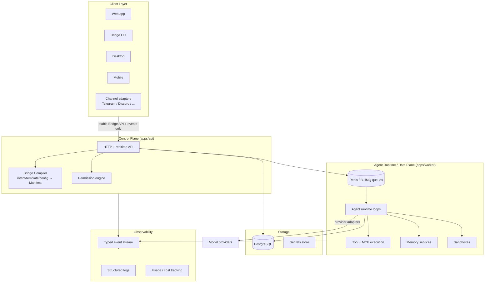
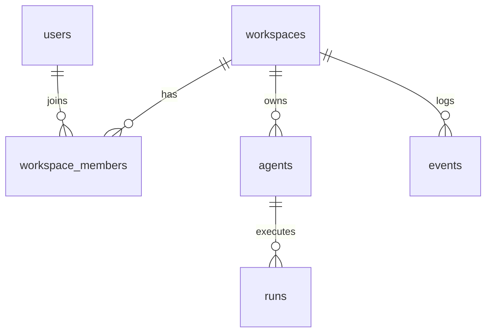

# Bridge Agent OS — Architecture

Status: Phase 0/1 (foundation). Decisions recorded in `docs/architecture/ADR-*.md`.

## 1. System Overview



Boundaries (explicit in the repository):

| Boundary | Lives in | Responsibility |
|---|---|---|
| Control plane | `apps/api` | users, workspaces, agents, manifests, templates, integrations, secret references, deployments, permissions, dashboards, configuration |
| Runtime / data plane | `apps/worker` | model execution, agent loops, tasks, tools, MCP, memory, queues, schedules, channels, sandboxes |
| Bridge Compiler | `apps/api` (module) + `@bridge/spec` | intent/template/config → validated Manifest → runtime config |
| Client layer | `apps/web`, later CLI/desktop/mobile/channels | thin clients of the API; zero domain logic |
| Observability | typed events (`@bridge/spec/events`) + `events` table + structured logs | runs, traces, tasks, tool calls, tokens, costs, failures, approvals |
| Contracts | `@bridge/spec`, `@bridge/sdk` | the only vocabulary shared across planes |

The API and worker are **separate processes sharing packages, one Postgres,
and one Redis** — a modular monolith. No microservices, no Kubernetes in the
MVP (ADR-0001). Nothing prevents splitting later because planes only
communicate through the DB, queues, and typed events.

## 2. Repository Layout

```text
apps/
  api/          Control plane: Hono HTTP API (ADR-0005)
  worker/       Data plane: BullMQ workers, schedules, agent loops (ADR-0004)
  web/          Web client: Vite + React SPA, thin (ADR-0006)
packages/
  spec/         @bridge/spec   — Manifest, dashboard schema, permissions, events, templates (ADR-0002)
  sdk/          @bridge/sdk    — provider / tool / channel adapter interfaces (ADR-0007)
  core/         @bridge/core   — ids, errors, env, structured logging (pino)
  db/           @bridge/db     — Drizzle schema, migrations, client (ADR-0003)
  ui/           @bridge/ui     — design tokens (CSS variables), brand assets, base styles
docs/
  architecture/ ADR-*.md
docker-compose.yml   Local Postgres + Redis
.github/workflows/   CI
```

Dependency rule (enforced by review, later by lint):

```text
apps/*  →  @bridge/{spec,sdk,core,db,ui}
@bridge/db → @bridge/core
@bridge/sdk → @bridge/spec
@bridge/spec → zod only        (pure contracts, no runtime deps)
Nothing imports from apps/*.
```

## 3. Stack

| Concern | Choice | ADR |
|---|---|---|
| Language | TypeScript, strict everywhere | ADR-0001 |
| Monorepo | pnpm workspaces + Turborepo | ADR-0001 |
| Lint/format | Biome (single tool) | ADR-0001 |
| Contracts/validation | Zod schemas in `@bridge/spec` | ADR-0002 |
| Database | PostgreSQL + Drizzle ORM + drizzle-kit migrations | ADR-0003 |
| Queue/background | Redis + BullMQ | ADR-0004 |
| API framework | Hono on Node | ADR-0005 |
| Web | Vite + React SPA, Tailwind v4 + token CSS | ADR-0006 |
| Adapters | `@bridge/sdk` interfaces (provider/tool/channel) | ADR-0007 |
| Tests | Vitest |  |
| Logging | pino, structured JSON |  |
| Local infra | Docker Compose (postgres:17, redis:7) |  |

## 4. The Bridge Manifest (`@bridge/spec`)

The canonical declarative description of an agent system. Zod is the single
source of truth; TS types are inferred. Key design points:

- `specVersion` integer literal per schema revision. `parseManifest()` runs
  `migrateManifest()` (versioned upgrade functions) before validation, so old
  stored manifests always load.
- Provider-independent `ModelRef { provider, model }`. Models are declared
  once (`models.default` + named `models.roles` like `reasoning`, `fallback`,
  `critic`) and referenced by role name from agents — routing changes touch
  one place.
- `agents[]` with an explicit `entryAgent`; each agent has instructions, an
  optional model role, tool grants (by name), and `canDelegateTo` for
  subagent spawning.
- `tools[]` declares grants (`native | mcp | http | custom` + config);
  `permissions` holds a default effect plus ordered first-match rules
  `{ resource, actions, effect: allow|deny|ask }`.
- `triggers` (cron schedules + event subscriptions), `channels`,
  `runtime.limits` (concurrency, run seconds, token budget, daily spend) and
  `runtime.sandbox` (network/filesystem levels) exist in v1 so that later
  phases extend rather than restructure.
- `dashboard` optionally embeds a Dashboard spec.

Templates = data: a partial Manifest + metadata, merged and validated through
the same pipeline as blank or AI-generated agents.

## 5. Dashboard Spec (`@bridge/spec/dashboard`)

`Dashboard → pages[] → sections[] → widgets[]` plus navigation and theme.
Widgets are a Zod discriminated union (`metric`, `chart`, `taskList`,
`agentStatus`, `activity`, `calendar`, `table`, `approvalQueue`, `chat`,
`logs`, `text`, `embed`), each with a typed `data` binding. Theme is design
tokens only (accent, background, appearance) — Bridge branding is not
overridable. The renderer is Phase 6; the schema is stable now so templates
and the AI editor target it from day one.

## 6. Permissions (`@bridge/spec/permissions`)

Pure, deterministic evaluation shipped now (used by every later phase):

```text
evaluatePermission(policy, resource, action) → allow | deny | ask
```

Ordered rules, first match wins (resource exact or glob `tool:github*`,
action exact or `*`), fall through to `policy.default`. Tools declare
`dangerousActions`; the compiler emits `ask` rules for them unless the user
explicitly allowed. Approval workflows (Phase 4) consume the `ask` result and
pause runs pending an `approval.*` event.

## 7. Events (`@bridge/spec/events`)

Typed catalog (envelope + per-type payload): `agent.*`, `run.*`, `task.*`,
`tool.*`, `approval.*`, `message.*`, `memory.*`, `deployment.*`,
`provider.error`. Envelope: `{ id, type, ts, workspaceId, agentId?, runId?,
data }`. Events are appended to the `events` table (audit log) and later
fanned out to realtime UI, channels, automations, and webhooks. Contracts are
final enough to build on; delivery infrastructure grows in Phases 8–9.

## 8. Adapter SDK (`@bridge/sdk`)

Three small interfaces keep vendors and integrations at the edge:

- **Provider**: `complete()` / `stream()` over normalized messages and tool
  calls, returns normalized usage (tokens) for cost tracking. A `MockProvider`
  ships for tests.
- **Tool**: name, description, Zod input schema, declared actions with
  `dangerous` flags, `execute(input, ctx)`; ctx carries workspace/agent/run
  ids, a logger, and a permission check.
- **Channel**: lifecycle (`start`/`stop`) + `send()` + inbound message
  handler. Runtime knows only this interface, never Telegram/Discord APIs.

## 9. Data Model (Phase 1 baseline)



`agents.manifest` is `jsonb` (the Manifest is the source of truth;
relational columns index what queries need: slug, status, spec_version).
`runs` carries status, trigger, timing, token counts and `cost_usd`.
`events` is the append-only audit/event log. All rows are workspace-scoped —
multi-tenant isolation is a query invariant from day one. Auth, secrets,
conversations, memory, approvals tables arrive with their phases as
migrations.

## 10. Security Architecture

- **Tenancy**: every domain table carries `workspace_id`; all queries filter
  by it. Cross-workspace access is a bug class, tested in CI as features land.
- **Secrets**: clients and manifests hold *references*, never values.
  Phase 2 implements encrypted storage (libsodium sealed boxes or KMS in
  Cloud); the abstraction boundary exists now (`@bridge/sdk` ctx exposes
  resolved credentials to adapters only at execution time).
- **Permissions before execution**: every tool call passes
  `evaluatePermission`; `ask` pauses the run and emits `approval.requested`.
- **Sandboxing**: `runtime.sandbox` levels in the Manifest now; enforcement
  (containerised execution) lands Phase 4+.
- **Audit**: all significant actions emit typed events to the `events` table.
- **Limits**: token budget / spend / concurrency fields exist in the spec and
  `runs` records usage, so enforcement is additive.

## 11. Runtime Model (for Phases 3+8)

Runs are queued jobs (BullMQ) executed by workers, never in-request. A run is
a state machine: `queued → running → (waiting_approval ↔ running) →
succeeded | failed | cancelled`, checkpointed in Postgres so workers can
crash and resume. Schedules use BullMQ repeatable jobs; triggers subscribe to
events. Long-running agents = durable state + queue, not long-lived
processes — this is what lets the UI close while agents keep working, and
what lets Cloud scale workers horizontally later.

## 12. Self-Host vs Cloud

Community = this repo: `docker compose up` brings Postgres + Redis + api +
worker + web. Cloud adds managed infra (hosted runtime, secrets/KMS, backups,
auth/teams/billing, metering) *around* the same images and packages — never
forks the runtime. Anything Cloud-only lives behind interfaces defined in
core packages (e.g. secrets driver, sandbox driver).
